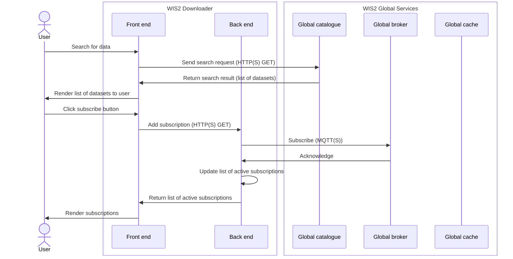
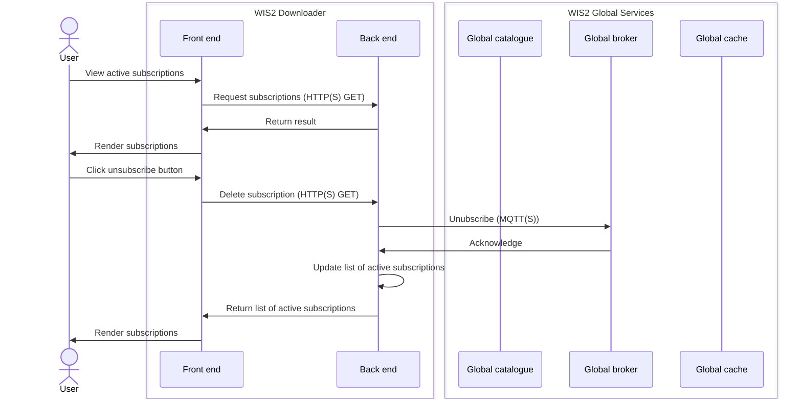
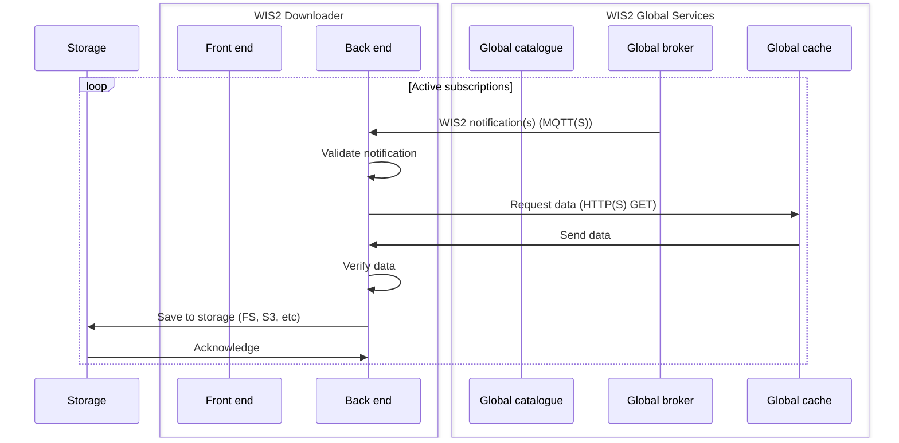

# wis2-downloader-backend

## How to create frozen executables

Install dependencies

``
pip install -r requirements.txt
``

Then run

``
pyinstaller -F --paths=D:\env\Lib\site-packages app.py
``

This will create the executable ready to be used with `subscriptions.json` in the same directory.

## How to use frozen executables

### Subscription backend
For `subscribe-backend.exe` there are two arguments:

- `--broker` (required): The URL to the global broker
- `--download_dir` (optional): The local directory where the data will be downloaded to

### Catalogue backend
For `catalogue-backend.exe` there are three arguments:

- `--url` (optional): The URL to the global discovery catalogue (defaults to that of Canada)
- `--query` (optional): The search term used to query the catalogue (e.g. Synop)
- `--country` (optional): The country code used to filter the catalogue by datasets originating within the bounding box associated with that country.

Running this executable will create a JSON file `datasets.json`, which contains the (meta)datasets response from the global discovery catalogue.

### Broker synchronisation backend
For `broker-backend.exe` there are no arguments.

Running this executable will create a JSON file `brokers.json`, which contains the broker titles, URLs, as well as the datetime of the synchronisation.

## Usage of Python file

Install dependencies

``
pip install -r requirements.txt
``

Run subscriber

``
flask.exe --app .\app.py run
``

Example API call (HTTP GET) to add subscription

``
curl http://localhost:5000/wis2/subscriptions/add?topic=cache/a/wis2/%2B/%2B/data/core/weather/surface-based-observations/%23
``

Example API call (HTTP GET) to delete subscription

``
curl http://localhost:5000/wis2/subscriptions/delete?topic=cache/a/wis2/%2B/%2B/data/core/weather/surface-based-observations/%23
``

Example API call (HTTP GET) to list subscriptions

``
curl http://localhost:5000/wis2/subscriptions/list
``

## Notes

- Special symbols (e.g. +, #) in topics need to be URL encoded, + = %2B, # = %23.
- Initial subscriptions can be stored in subscriptions.json
- All data downloaded to ./downloads. This will be updated in future to allow configuration. 
- 2 child threads created, one to download the data and another for the subscriber
- The main program/thread is the flask Front end that manages the subscriptions and downloads

## Workflow

### Search and subscribe

### Unsubscribe

### Download
